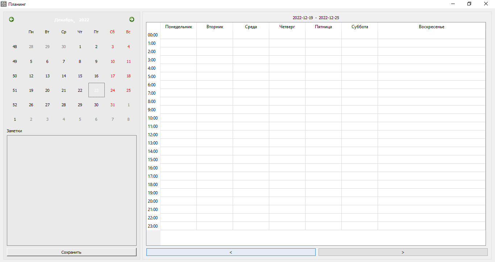

# **Планинг** — Программное обеспечение для планирования задач

**Статус:** Курсовой проект по дисциплине «Технологии разработки программного обеспечения»  
**Цель:** Проектирование и разработка настольного приложения для визуального планирования задач по дням недели и часам с функцией заметок.

---

## 📌 **О проекте**

«Планинг» — это программная система, разработанная для помощи пользователям в эффективном распределении времени. Приложение позволяет планировать задачи на каждый час дня в течение недели, вести заметки и удобно перемещаться между неделями.

**Ключевые особенности:**
*   **Визуальное недельное расписание:** Таблица 24x7 (часы × дни недели) для почасового планирования.
*   **Заметки на неделю:** Текстовое поле для общих заметок, относящихся к текущей неделе.
*   **Гибкая навигация:** Переключение между неделями с помощью кнопок и календаря.
*   **Автосохранение задач:** Все изменения в таблице автоматически сохраняются в локальной базе данных SQLite.
*   **Простой интерфейс:** Интуитивно понятный GUI, разработанный на PyQt5.

**Важно:** Данный репозиторий содержит исходный код курсового проекта в том виде, в котором он был сдан. Он предназначен в первую очередь для **ознакомления, оценки и демонстрации** проделанной работы.

---

## 🗂️ **Структура репозитория**

```
├── README.md               # Основная документация проекта
├── db.py                   # Модуль работы с SQLite базой данных
├── model.py                # Бизнес-логика и модели данных
├── window.py               # Графический интерфейс (PyQt5)
├── planning.db             # Файл базы данных SQLite
├── planning.png            # Иконка приложения
├── requirements.txt        # Список зависимостей Python (PyQt5)
└── screenshots/            # Папка со скриншотами интерфейса
    └── interface_screenshot.png  # Скриншот главного окна программы
```

---

## 🖥️ **Демонстрация интерфейса**

### Главное окно приложения


**Элементы интерфейса:**
1.  **Календарь:** Для перехода к конкретной дате и соответствующей ей неделе.
2.  **Заголовок периода:** Отображает даты начала и конца текущей отображаемой недели.
3.  **Таблица планирования:** Колонки — дни недели, строки — часы (00:00 - 23:00).
4.  **Панель навигации:** Кнопки «<» и «>» для переключения на предыдущую/следующую неделю.
5.  **Поле для недельных заметок:** Многострочное текстовое поле.
6.  **Кнопка «Сохранить»:** Фиксирует изменения в поле заметок для текущей недели.

---

## ⚙️ **Технологический стек и архитектура**

*   **Язык программирования:** Python 3.9
*   **GUI-библиотека:** PyQt5
*   **База данных:** SQLite (встроенная, файл `planning.db`)
*   **Архитектура:** Разделение на слои:
    *   `db.py` — слой работы с данными (DAO)
    *   `model.py` — слой бизнес-логики
    *   `window.py` — слой представления (View/Controller)
---

## 🧩 **Основные функции**

Приложение предоставляет следующие возможности:

### Работа с таблицей планирования:
*   **Добавление задачи:** Ввод текста в ячейку (день × час)
*   **Редактирование:** Двойной клик по ячейке для изменения
*   **Удаление:** Очистка содержимого ячейки

### Работа с заметками:
*   Ввод и редактирование текстовых заметок на неделю
*   Сохранение кнопкой «Сохранить»
*   Удаление заметки (очистка поля и сохранение)

### Навигация:
*   Переключение недель кнопками «<» и «>»
*   Выбор конкретной недели через календарь
*   Автоматическое отображение текущей недели при запуске

### Сохранение данных:
*   Автоматическое сохранение изменений в таблице при переходе между неделями
*   Сохранение заметок по требованию (кнопка «Сохранить»)

---

## 🔍 Как ознакомиться с проектом

Поскольку проект является учебным и не требует установки:

1. **Просмотр кода:** Изучите файлы `db.py`, `model.py`, `window.py` для понимания архитектуры и расчётов.

2. **Анализ базы данных:** Файл `planning.db` можно открыть в [DB Browser for SQLite](https://sqlitebrowser.org/) для просмотра структуры и данных.

3. **Просмотр интерфейса:** Скриншот интерфейса доступен в папке `screenshots/`.

4. **Запуск:** Для запуска требуется Python 3.9 и установленные зависимости:
   ```bash
   pip install PyQt5
   ```
   Затем выполнить:
   ```bash
   python window.py
   ```
